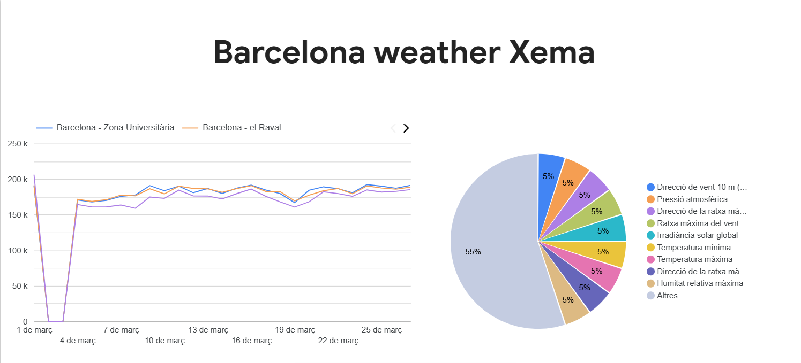

# Catalonia Weather Data Pipeline (XEMA)
This project was developed as the final project for the [DataTalksClub](https://datatalks.club/) [Data Engineering Zoomcamp](https://github.com/DataTalksClub/data-engineering-zoomcamp/tree/main), an intensive hands-on program focused on building real-world data platforms.

The goal of the project is to design and implement an end-to-end data pipeline that continuously ingests and processes meteorological data from Catalonia, using open data provided by the Generalitat de Catalunya through its public data portal.

Weather data is generated constantly and can be highly valuable for analysis, monitoring, and decision-making. However, working with this data presents several challenges: it is distributed across APIs, arrives in raw formats, and requires transformation to be useful for analytics.

To address this, the project builds a modern data stack that:

- Extracts raw weather data from the XEMA API
- Stores it in a scalable data lake
- Loads it into a data warehouse
- Transforms it into analytics-ready models
- Enables visualization and insights through dashboards

The result is a reproducible and automated pipeline that demonstrates core data engineering concepts such as orchestration, data modeling, and cloud-based processing.
## 1. Project Overview
- **Goal**: build an end-to-end data pipeline to ingest and transform meteorological data from Catalonia (Barcelona region) using the open XEMA API: [https://analisi.transparenciacatalunya.cat](https://analisi.transparenciacatalunya.cat)
- **Stack**: Python, Apache Airflow, Google Cloud Storage, BigQuery, dbt, GitHub Codespaces

## 2. Architecture
The data pipeline extracts daily weather observations from the XEMA API, stores the raw data in Google Cloud Storage, loads it into BigQuery, and transforms it with dbt to create analytical tables.

```text
XEMA API → ingest_data.py → GCS (Data Lake)
                                    ↓
                             BigQuery (raw tables)
                                    ↓
                              dbt (staging views → fact tables)
```

- **Airflow**: Orchestrates the workflow, scheduling daily ingestion and triggering dbt transformations.
- **GCS**: Acts as the Data Lake, providing scalable cloud storage for all original raw data files.
- **BigQuery**: Serves as the Data Warehouse for storing raw tables, staging views, and production models.
- **dbt**: Cleans raw data and builds structured fact and dimension tables ready for analysis.

### Data Model
- **Raw**: `raw_weather_data` (partitioned by day), `raw_dim_stations`, `raw_dim_variables`
- **Staging**: `stg_weather_data`, `stg_dim_stations`, `stg_dim_variables` (views, type casting and renaming only)
- **Core**: `fct_weather_readings` (minute-level, partitioned), `fct_daily_weather` (daily aggregates, lean)

## Dashboard


[Dashboard](https://lookerstudio.google.com/reporting/60d47c01-1d29-480f-bf9b-0ff7a74127d6)

## 3. Setup Instructions
Step-by-step for GitHub Codespaces:

1. Clone and open in Codespaces
2. Copy and fill in environment variables:
```bash
cp .env.example .env
```
Edit the `.env` file and set:
- `GCP_PROJECT_ID`: Your exact GCP Project ID.
- `GCP_BUCKET_NAME`: A globally unique name for your new GCS bucket.

**Step 3.2: GCP Authentication**
You need to provide your Google Cloud Service Account JSON key to authenticate.
- **For Local Development**:
  Place your Service Account JSON key file in the `credentials/` folder (this folder is ignored by Git for security).
  Edit your `.env` file and set the absolute path to your key:
  ```env
  GOOGLE_APPLICATION_CREDENTIALS=/absolute/path/to/catalonia-weather-pipeline/credentials/your-key.json
  ```
- **For GitHub Codespaces**:
  Create a GitHub Codespaces Repository Secret named `GCP_SA_KEY` containing the entire JSON text of your key. Then, in the Codespaces terminal, run:
  ```bash
  bash .devcontainer/setup_auth.sh
  ```
  *(This correctly formats your key at `/tmp/gcp-key.json` and updates `GOOGLE_APPLICATION_CREDENTIALS`)*.

**Step 3.3: Export Authentication Variable**
For Terraform and dbt to detect your credentials in your current terminal session, export the variable manually:
```bash
# If running locally (update your path):
export GOOGLE_APPLICATION_CREDENTIALS="/absolute/path/to/catalonia-weather-pipeline/credentials/your-key.json"

# If in Codespaces:
export GOOGLE_APPLICATION_CREDENTIALS="/tmp/gcp-key.json"
```

## 4. Setup Infrastructure with Terraform
Use Terraform to deploy the GCS Data Lake bucket and BigQuery Dataset.

```bash
cd terraform
cp terraform.tfvars.example terraform.tfvars
```
Edit `terraform.tfvars`:
- Change `project_id` to match your GCP Project ID.
- Change `bucket_name` to match the exact bucket name you set in your `.env` file.

Initialize and apply the Terraform configuration:
```bash
terraform init
terraform apply
```
Type `yes` when prompted.

## 5. Setup dbt (Data Build Tool) Profiles
Airflow runs dbt commands for data transformation. You must configure the dbt connection profile to allow BigQuery access.

```bash
cd ../dbt_xema
cp profiles.yml.example profiles.yml
```
Edit `profiles.yml` inside the `dbt_xema` directory:
- Change `project: your-gcp-project-id` to your actual GCP Project ID.
- Change `keyfile: /path/to/service-account-key.json` to the absolute path of your JSON key (e.g., `/tmp/gcp-key.json` for Codespaces, or the path inside your local `credentials/` folder).

Verify the dbt connection:
```bash
dbt debug --profiles-dir .
```
Change back to the root directory for the next steps:
```bash
cd ..
```

## D. Running Airflow

To start Apache Airflow locally or in your Codespace, use the provided startup script from the root of the project:
```bash
bash start_airflow.sh
```

**Accessing the Airflow UI:**
- **Local**: Open your browser and go to `http://localhost:8080`
- **Codespaces**: Go to the "Ports" tab in the bottom panel of VS Code and click the web/globe icon for port 8080.

**Login Credentials:**
- **Username**: `admin`
- **Password**: `admin`

## E. Running the Pipeline

Once you are logged into the Airflow UI:
1. Locate the DAG named `xema_daily_weather_pipeline`.
2. Toggle the switch on the left from **Paused** to **Unpaused** (the switch will turn blue).
3. Click the **Play button ▶️** on the right side and select **Trigger DAG**.

### What the Pipeline Tasks Do:
1. `ingest_data_to_gcs`: A Python script queries the XEMA API for the execution date, processes it, and uploads it as a Parquet file to the GCS Data Lake.
2. `load_gcs_to_bq_staging`: Reads the Parquet file from GCS and dynamically appends or creates the raw data in BigQuery (`raw_weather_data`), partitioned by day.
3. `run_dbt_transformations`: Executes `dbt run` and `dbt test` to execute SQL models on the raw BigQuery data, resulting in clean, analytical models like `fct_daily_weather`.

## F. Debugging Section

### Common Errors and Fixes

**1. GCP Authentication Issues**
- **Error:** `google.auth.exceptions.DefaultCredentialsError` or Permission Denied in Terraform/Airflow.
- **Fix:** Ensure the `GOOGLE_APPLICATION_CREDENTIALS` environment variable is pointing to a valid Service Account JSON key path. Run `echo $GOOGLE_APPLICATION_CREDENTIALS` to verify your terminal can see it. Re-export it if necessary.

**2. Missing Environment Variables inside Airflow**
- **Error:** `ValueError: Missing critical environment variables: GCP_PROJECT_ID...`
- **Fix:** Ensure your `.env` file is located precisely at the root of the project and that `GCP_PROJECT_ID` and `GCP_BUCKET_NAME` are not empty. 

**3. Terraform Bucket Creation Error**
- **Error:** `googleapi: Error 409: Your previous request to create the named bucket succeeded and you already own it.` or `Bucket name is already taken.`
- **Fix:** GCS bucket names must be globally unique across *all* of Google Cloud. Edit `GCP_BUCKET_NAME` in `.env` and `bucket_name` in `terraform.tfvars` to a more unique name (e.g., append random numbers or initials) and restart step 4.

**4. dbt Profile Error / Command Not Found**
- **Error:** `Profile xema_weather target dev not found` or `File /path/to/service-account-key.json not found`
- **Fix:** Ensure you have correctly copied `profiles.yml.example` to `profiles.yml` inside the `dbt_xema/` directory and replaced the placeholder project ID and keyfile paths with actual information. Also ensure your bash session has exported the variable correctly.

**5. Airflow Login Issues in Codespaces**
- **Error:** Getting CSRF Token errors or immediate logouts when attempting to log in on Codespaces.
- **Fix:** This is a Codespaces proxy issue. The `start_airflow.sh` script applies proxy fixes (e.g., disables CSRF validation). Make sure you start Airflow via `bash start_airflow.sh` rather than manually calling `airflow webserver`. Ensure no stale zombie webserver processes are running.
